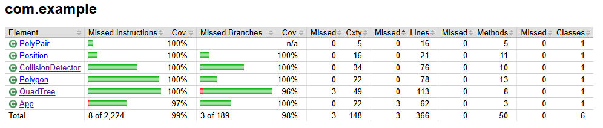

# Domashno quadtree nz
*Пускам домашното и в github, за да ми е по-лесно на мен*

Този път съм направил custom форми на принципа на точки, които са свързани последнователно, за да образуват фигурите. 
  
Това ми позволява с помоща на един мой стар пригоден CollisionDetector от 2020 да проверявам дали фигурите се пресичат перфектно с математически формули. 
  
Затова правя и случайни фигури, но съм hard-code-нал фигурите от условието.
  
<<<<<<< HEAD
(интересно нещо - като ползвам Polygon, за да дефинирам обсега на LEAF-овете в дървото, мога лесно да направя дървото да създава разнообразни фигури за самата си структура, за да стане още по-оптимално и интересно, *но това за следващото домашно*)
=======

>>>>>>> 84ac445 (Finished pls work)
